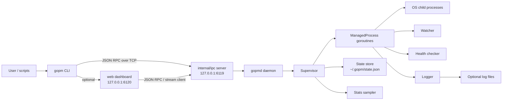
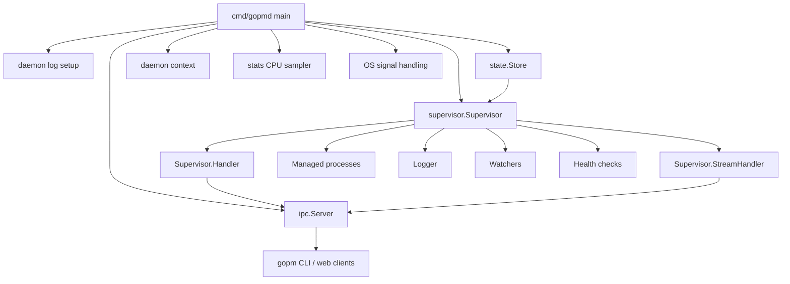
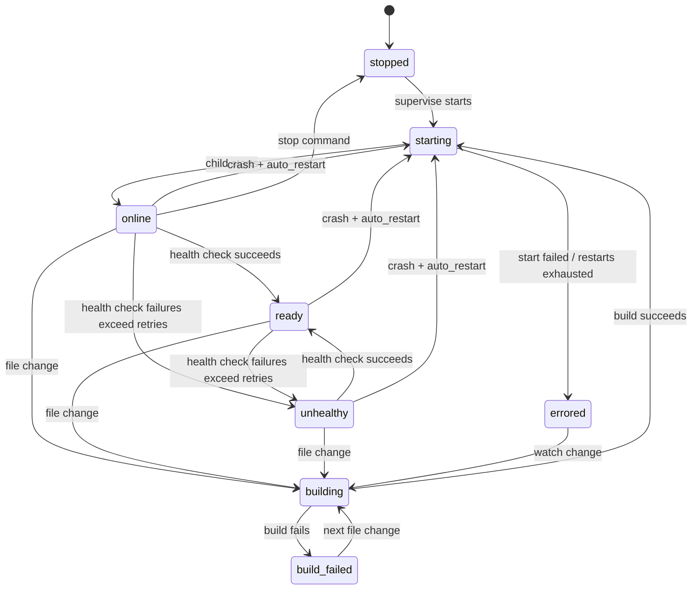
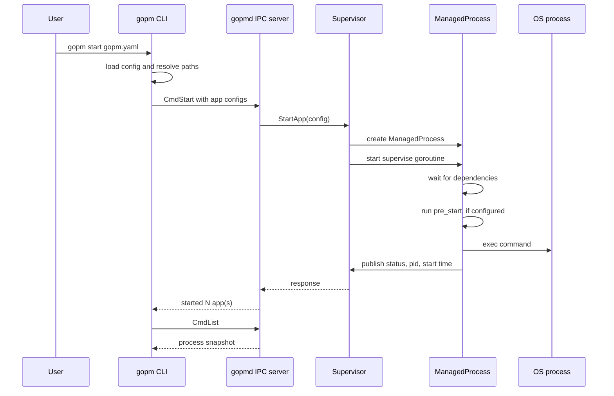
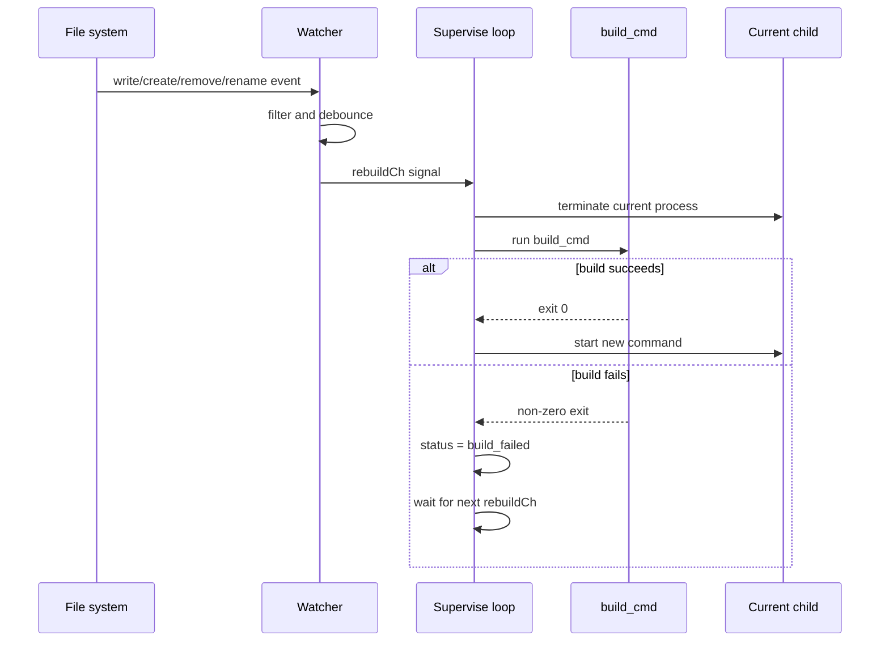

# gopm Solution Architecture

This document is an onboarding guide for engineers joining the `gopm` codebase.
It explains what the system does, why it is structured the way it is, how the
major packages relate to each other, and how the main execution flows work.

`gopm` is a cross-platform process manager written in Go. It is similar in
spirit to PM2, but intentionally smaller and built around pure-Go primitives.
Users define applications in `gopm.yaml`; `gopm` starts a long-lived daemon,
then the daemon supervises those applications, restarts them after crashes,
captures logs, watches files during development, serves status over IPC, and
persists process state across daemon restarts.

## Quick Orientation

| Area | Path | Responsibility |
| --- | --- | --- |
| CLI entrypoint | `cmd/gopm/main.go` | Parses commands, validates config, starts the daemon if needed, renders human/JSON output, starts the web dashboard and live UI. |
| Daemon entrypoint | `cmd/gopmd/main.go` | Starts the supervisor, IPC server, CPU sampler, restores persisted apps, handles shutdown signals. |
| Config model | `pkg/config/config.go` | YAML-facing configuration types and basic validation. |
| IPC transport | `internal/ipc` | Newline-delimited JSON RPC and streaming TCP protocol between CLI/web clients and daemon. |
| Supervision core | `internal/supervisor` | Process registry, lifecycle loop, restart policy, dependency waiting, health status, watch rebuilds, exec, logs RPCs. |
| Logging | `internal/logger` | Per-process ring buffers, optional log files, rotation, subscriptions for streaming. |
| File watching | `internal/watcher` | Recursive `fsnotify` watching, ignore rules, extension filtering, debounce. |
| Persistence | `internal/state` | Atomic JSON state store at `~/.gopm/state.json`. |
| Stats | `internal/stats` | Memory RSS and sampled CPU percentage, with OS-specific implementations. |
| Process control | `internal/process` | OS-specific process group creation and process tree termination. |
| Daemon spawn | `internal/daemon` | OS-specific detached daemon launch. |
| Health checks | `internal/healthcheck` | HTTP polling and ready/unhealthy transitions. |
| Web dashboard | `internal/web` | Lightweight HTTP dashboard, JSON APIs, SSE log streaming, Prometheus metrics. |

## Architecture At A Glance



The main architectural decision is the split between a short-lived CLI and a
long-lived daemon:

- The CLI can be simple, fast, and script-friendly.
- The daemon can own all mutable process state and long-running goroutines.
- The managed processes keep running after the user closes the terminal.
- Cross-platform behavior is isolated behind small packages with build tags.

## Binaries

### `gopm`

`gopm` is the user-facing command in `cmd/gopm/main.go`.

It handles:

- Global `-host <addr>` override for talking to a non-default daemon address.
- Daemon auto-start via `ensureDaemonRunning`.
- Config loading and path normalization for `start`.
- Table, JSON, and names-only output for `list`.
- Snapshot logs, filtered logs, all-process logs, and follow-mode streaming.
- `exec` commands that run in a managed process's configured environment.
- `validate`, `web`, `ui`, `completion`, `generate-service`, `daemon`, and `shutdown`.

The CLI does not supervise processes directly. That is deliberate. It keeps
terminal invocations stateless and makes one daemon the single writer of
process lifecycle state.

### `gopmd`

`gopmd` is the daemon in `cmd/gopmd/main.go`.

It does the long-lived work:

- Sets daemon log output to `~/.gopm/gopmd.log` when launched as a background child.
- Creates the state store.
- Creates the supervisor.
- Starts the CPU sampler.
- Creates the IPC server at `127.0.0.1:6119`.
- Registers a stream handler for log follow and exec.
- Restores persisted apps from `~/.gopm/state.json`.
- Waits for OS shutdown signals or the `shutdown` IPC command.
- Calls `Supervisor.Shutdown()` before exiting.

The daemon owns process state because it is the only component guaranteed to
stay alive for as long as managed processes should be supervised.

### Daemon Internals: How `gopmd` Brings The Project Together

The daemon is the composition root of the whole application. Most packages do
one focused job, but `cmd/gopmd/main.go` wires those jobs together into a
running process manager.

Daemon boot sequence:

1. Configure daemon logging with `log.SetPrefix` and `log.SetFlags`.
2. If launched by `gopm` as a background child, detect `GOPM_DAEMON=1` through
   `daemon.IsDaemonChild`.
3. Resolve the user home directory with `os.UserHomeDir`.
4. Create `~/.gopm` with `os.MkdirAll`.
5. Open `~/.gopm/gopmd.log` with `os.OpenFile` and redirect the standard Go
   logger there. This makes background startup failures diagnosable.
6. Resolve the state file path with `state.DefaultPath`.
7. Create a `state.Store`.
8. Create one `supervisor.Supervisor`, passing the store into it.
9. Create a daemon-wide `context.Context` and cancellation function.
10. Start the CPU sampler with `stats.StartCPUSampler(ctx)`.
11. Create the IPC server with `ipc.NewServer`.
12. Wrap the supervisor handler so `CmdShutdown` cancels the daemon context.
13. Register streaming behavior with `srv.SetStreamHandler(sup.StreamHandler())`.
14. Bind the TCP listener with `srv.Listen`.
15. Load saved state from disk and call `sup.StartApp` for every persisted app.
16. Register OS shutdown signals with `signal.Notify`.
17. Start the IPC accept loop with `srv.Serve(ctx)`.
18. Block until context cancellation.
19. On cancellation, call `sup.Shutdown()` and `srv.Close()`.

That sequence is what turns isolated packages into one system:



The daemon also defines the main ownership boundary:

- The CLI owns user interaction only.
- The IPC server owns transport and request dispatch only.
- The supervisor owns all managed process state.
- The logger owns log buffers, files, and stream subscribers.
- The state store owns persistence.
- The daemon owns lifetime: startup, restore, cancellation, and shutdown order.

This is why most features eventually pass through the daemon. For example,
`gopm web`, `gopm logs -f`, `gopm exec`, and `gopm list` are different user
interfaces, but they all converge on the same daemon-owned supervisor state.

## Communication Model

The CLI, web dashboard, and daemon communicate through `internal/ipc`.

### Why newline-delimited JSON over TCP?

The project uses newline-delimited JSON on localhost instead of Unix sockets,
named pipes, gRPC, or HTTP for the control plane.

Reasons:

- TCP loopback works consistently on Linux, macOS, and Windows.
- JSON structs are easy to inspect and extend.
- One request per connection keeps the simple RPC path easy to reason about.
- Streaming commands can reuse the same transport by keeping the connection open.
- The implementation stays pure Go and dependency-light.

### Normal RPC

Normal commands follow this shape:

1. CLI creates an `ipc.Request`.
2. `ipc.Client.Send` opens a TCP connection.
3. Client JSON-encodes the request plus `\n`.
4. `ipc.Server.handle` reads one line and unmarshals it.
5. The server calls `Supervisor.Handler()`.
6. The response is JSON-encoded and the connection closes.

Examples: `start`, `stop`, `restart`, `delete`, `list`, `logs`, `logs --all`,
`ping`, `shutdown`.

### Streaming RPC

Streaming commands use the same TCP server but bypass the normal single-response
path:

- `CmdLogStream` streams log events for `logs -f`.
- `CmdExec` streams stdout/stderr from an ad-hoc command.

The server calls `Supervisor.StreamHandler()`, which writes newline-delimited
`ipc.LogEvent` objects until the stream ends.

## Configuration Model

The YAML schema lives in `pkg/config/config.go`.

Top-level shape:

```yaml
apps:
  - name: api
    command: ./bin/api
    args: []
    cwd: ./services/api
    env:
      PORT: "8080"
    env_file: .env
    auto_restart: true
    max_restarts: 10
    log_file: ./logs/api.log
    log_max_size_mb: 10
    log_max_backups: 5
    pre_start: "go build ./..."
    depends_on:
      - db
    groups:
      - backend
    port: 8080
    watch:
      enabled: true
      dirs: ["./"]
      extensions: [".go"]
      ignore: ["./vendor", "./.git"]
      build_cmd: "go build -o ./bin/api ./cmd/api"
      debounce_ms: 300
    health_check:
      url: "http://127.0.0.1:8080/health"
      interval: "5s"
      timeout: "2s"
      retries: 3
    on_crash:
      webhook: "https://example.com/hook"
```

`config.Load` parses YAML and calls `Validate`. Validation currently checks:

- At least one app exists.
- Each app has a name.
- App names are unique.
- Each app has a command.

The CLI performs additional path-oriented checks in `cmdValidate`, because path
resolution depends on the location of the config file.

### Path Resolution

Config paths such as `cwd`, `log_file`, and `env_file` can be relative. During
`gopm start`, the CLI resolves those paths relative to the config file before
sending app configs to the daemon. This design avoids making the daemon depend
on the user's current shell directory.

Watch directories are interpreted relative to the app's `cwd` by the watcher,
which matches the development workflow: if an app runs from `services/api`, then
`watch.dirs: ["./"]` means "watch the app directory".

## Supervisor Core

The supervisor is the heart of the daemon. It lives in `internal/supervisor`.

### Main Types

`Supervisor` owns:

- `procs`: map of app name to `ManagedProcess`.
- `nextID`: stable numeric IDs for list output.
- `ctx` and `cancel`: daemon-level cancellation.
- `logger`: shared log registry.
- `store`: persistence backend.

`ManagedProcess` owns:

- Immutable-ish user config for that app.
- Current status, PID, start time, restart count.
- `stopCh`: closed to request process shutdown.
- `rebuildCh`: receives debounced file change signals.
- `done`: closed when the supervise goroutine exits.
- `restartMu`: prevents overlapping restarts for the same app.
- `crashNotified`: prevents duplicate webhook notifications for one failure state.

The important relationship: one `ManagedProcess` usually has one active
supervise goroutine, and that goroutine is responsible for starting and waiting
on one OS child process at a time.

### Lifecycle State Machine



Statuses are defined in `internal/supervisor/process.go`:

- `starting`
- `online`
- `ready`
- `unhealthy`
- `stopped`
- `errored`
- `building`
- `build_failed`

### Start Flow



### Why a goroutine per process?

Each app has independent blocking work:

- waiting for dependencies,
- running `pre_start`,
- waiting on the OS process,
- waiting for stop/rebuild/health events,
- applying restart backoff.

A goroutine per app is a natural Go fit. It keeps the supervisor's shared map
small and locked only for registry access, while each app's lifecycle logic can
block without freezing other apps.

### Restart Policy

When a process exits:

- If `auto_restart` is false, status becomes `stopped`.
- If `auto_restart` is true and `max_restarts` is not exhausted, the process
  restarts after backoff.
- Backoff is `restartCount * 500ms`, capped at 15 seconds.
- If `max_restarts` is exhausted, status becomes `errored`.
- If watch mode is enabled, an errored/build-failed process can still recover
  when the next file change triggers a successful build.

The supervisor intentionally separates "user stopped this" from "process
crashed" by using `stopCh`. That keeps manual stops from being treated as
crashes.

### Dependency Ordering

`depends_on` is handled by `waitForDeps`. Before an app starts, it waits until
each dependency exists and has status `online` or `ready`.

This is a simple readiness model. It avoids a full scheduler while supporting
common service startup order, such as `api` waiting for `db`.

### Pre-start Hooks

`pre_start` runs once before the process supervision loop. Output is streamed
into the app log. If it fails, the supervisor logs the failure and continues.

This behavior is lenient by design. It prevents a non-critical hook from making
an app permanently impossible to start, but engineers should be aware that this
means `pre_start` is not currently a hard gate.

### Environment Assembly

When building an `exec.Cmd`, the supervisor starts with `os.Environ()`, then
adds values from `env_file`, then applies inline `env`.

Inline `env` wins over `env_file`. This precedence is useful because shared
`.env` files can provide defaults while YAML can override per app.

## Logging Architecture

Logs are managed by `internal/logger`.

Each process gets a `procLog` containing:

- A ring buffer of the latest 1000 log entries.
- Optional file output.
- Optional rotation settings.
- Per-process stream subscribers.
- A parent pointer so events can also fan out to global subscribers.

### Why a ring buffer?

The daemon should not keep unbounded logs in memory. A fixed-size ring buffer:

- gives `gopm logs` fast access to recent output,
- protects memory usage,
- is simple to reason about under concurrent writes,
- keeps disk logging optional.

### Log Sources

The logger captures:

- child stdout,
- child stderr with `[stderr]` prefix,
- build command output,
- pre-start command output,
- daemon-generated lifecycle lines such as `[gopm] build ok`,
- watcher diagnostic lines with `[watcher]`.

### Log Files And Rotation

If `log_file` is configured, log lines are appended with timestamps. Rotation is
controlled by:

- `log_max_size_mb`
- `log_max_backups`

When the size threshold is exceeded, `.log` becomes `.log.1`, older backups are
shifted, and a fresh file is opened. If backups are disabled, the current file
is removed/truncated.

### Streaming Logs

`Logger.Subscribe` and `Logger.SubscribeAll` create buffered channels that
receive `LogEvent` values. The supervisor stream handler uses these for:

- `gopm logs <name> -f`
- `gopm logs --all -f`
- web dashboard SSE log streams.

Event fan-out is non-blocking. If a subscriber is slow, events can be dropped
instead of blocking process logging.

## File Watch And Rebuild

The watcher lives in `internal/watcher` and wraps `github.com/fsnotify/fsnotify`.

It provides:

- recursive directory registration,
- automatic watching of newly created subdirectories,
- extension filtering,
- ignore-prefix filtering,
- debounce before sending a rebuild signal.

The watcher sends to `ManagedProcess.rebuildCh`, which is buffered with capacity
1. This coalesces bursts of file events and prevents rebuild spam.

### Rebuild Flow



This design keeps the existing child running until a rebuild signal arrives.
Once the signal arrives, the current child is terminated before `build_cmd`
runs. If the build succeeds, the process starts again; if it fails, the app is
parked in `build_failed` until the next change.

## Health Checks

HTTP health checks live in `internal/healthcheck`.

The supervisor creates a checker when `health_check.url` is configured. The
checker polls the URL on an interval using a client timeout. It emits:

- `StatusReady` after a successful 2xx or 3xx response.
- `StatusUnhealthy` after consecutive failures reach the retry threshold.

The supervisor translates those into process statuses:

- `ready`
- `unhealthy`

Health checks do not currently restart unhealthy processes by themselves. They
only update status. This is a good boundary: process exit/restart policy remains
inside the supervision loop, while the health checker is only a status producer.

## Resource Statistics

`internal/stats` exposes:

- `MemoryRSS(pid)` for resident memory.
- `TrackPID(pid)` and `UntrackPID(pid)` for CPU sampling.
- `CPUPercent(pid)` for latest sampled CPU percentage.
- `StartCPUSampler(ctx)` to run sampling every 500ms.

Platform-specific files implement the low-level details:

- Linux memory from `/proc/<pid>/status`.
- Linux CPU from `/proc/<pid>/stat`.
- Windows memory from `GetProcessMemoryInfo`.
- Windows CPU from `GetProcessTimes`.
- Other platforms return zero/unsupported values.

The daemon starts one global sampler. The supervisor tracks a PID when it starts
and untracks it when the process exits, stops, rebuilds, or restarts.

## Persistence

The state package writes JSON to `~/.gopm/state.json`.

The persisted model stores:

- app config,
- restart count.

It does not store:

- PID,
- status,
- uptime.

That is intentional. After daemon restart or machine reboot, old PIDs are not
trustworthy. The daemon treats persisted apps as desired state and starts fresh
child processes. The restart count is currently written to disk for continuity,
but daemon restore only uses the app config when recreating processes.

### Why atomic writes?

`Store.Save` writes to a temp file, syncs it, closes it, then renames it over
the target state file. This protects the state file from being partially written
if the daemon crashes mid-save.

## Process And Daemon Platform Boundaries

Cross-platform behavior is isolated in small packages with build tags.

`gopm` is mostly ordinary Go code, but a process manager must touch the
operating system for things regular application servers usually avoid:

- spawning child processes,
- detaching the daemon from the user's terminal,
- killing entire process trees,
- reading process memory and CPU counters,
- handling OS shutdown signals,
- opening local sockets,
- writing state and log files safely.

The codebase keeps those OS-facing details behind narrow APIs so the supervisor
can remain portable and easy to test.

### OS Libraries And System APIs Used

| Package/API | Used in | Why it is needed |
| --- | --- | --- |
| `os` | CLI, daemon, config, logger, state, stats, supervisor | Reads files, discovers home directory, creates `~/.gopm`, opens logs/state, reads environment variables, checks paths, exits CLI commands. |
| `os/exec` | CLI, daemon spawn, supervisor, process control | Starts `gopmd`, starts managed applications, runs `pre_start`, runs `watch.build_cmd`, runs `gopm exec`, shells out to `taskkill` on Windows. |
| `os/signal` | CLI follow/ui/web, daemon | Captures Ctrl+C/SIGTERM so long-running commands and the daemon can shut down cleanly. |
| `syscall` | daemon/process/stats platform files | Sets process/session attributes, sends Unix signals, loads Win32 DLL functions, defines process creation flags. |
| `net` | IPC server/client, supervisor port checks | Opens TCP loopback control socket, connects clients to daemon, checks configured app port conflicts. |
| `net/http` | healthcheck, supervisor webhook, web dashboard | Polls health check URLs, sends crash webhooks, serves dashboard/API/metrics. |
| `path/filepath` | CLI, config, daemon, logger, state, watcher | Handles platform-correct paths, absolute path checks, config-relative paths, recursive walking. |
| `context` | daemon, IPC, supervisor, stats, healthcheck, web | Coordinates cancellation across daemon shutdown, child commands, samplers, health polling, and HTTP server shutdown. |
| `bufio` | IPC, logger, supervisor env parsing | Reads newline-delimited JSON, scans process output, parses `.env` files. |
| `encoding/json` | IPC, state, CLI JSON output, web | Serializes the control protocol, state file, JSON CLI output, and dashboard API responses. |
| `gopkg.in/yaml.v3` | config | Parses `gopm.yaml`. |
| `github.com/fsnotify/fsnotify` | watcher | Receives cross-platform filesystem change events. |

### Why Direct OS Access Is Required

A process manager cannot be implemented only as business logic. It has to
control operating-system processes and observe operating-system state.

The key OS responsibilities are:

- **Daemonization:** `gopm` must start `gopmd` and return immediately while the
  daemon keeps running.
- **Process isolation:** each managed app should run in a separate process group
  so stopping one app can also stop descendants it created.
- **Process termination:** stopping an app must not leave child processes behind.
- **Signal handling:** Ctrl+C, SIGTERM, or Windows interrupts should lead to
  graceful cleanup rather than abrupt exit.
- **Resource stats:** memory and CPU usage are exposed by OS-specific APIs.
- **File persistence:** state and logs must survive CLI exits and daemon restarts.

The architecture keeps those details in `internal/daemon`, `internal/process`,
`internal/stats`, and `cmd/gopmd/signals_*` rather than scattering them across
the supervisor.

### `internal/daemon`

Used by the CLI to spawn `gopmd` in the background.

- Unix uses `Setsid`.
- Windows uses `CREATE_NEW_PROCESS_GROUP` and `CREATE_NO_WINDOW`.
- Both set `GOPM_DAEMON=1`, which lets the daemon know it should redirect logs
  to `~/.gopm/gopmd.log`.

Implementation details:

- The CLI locates `gopmd` using `$GOPMD`, then the CLI binary directory, then
  `PATH`.
- `daemon.Spawn` uses `exec.Command` so the CLI can start another binary without
  linking daemon code into the CLI process.
- `cmd.Env` includes `GOPM_DAEMON=1`. This environment marker is the handshake
  between CLI and daemon.
- Standard streams are left nil. On Windows this avoids broken inherited console
  handles; on Unix it detaches the daemon from the CLI's terminal.

Unix:

- `syscall.SysProcAttr{Setsid: true}` creates a new session.
- A new session detaches the daemon from the controlling terminal.
- This prevents terminal signals sent to the user's shell from accidentally
  killing the background daemon.

Windows:

- `syscall.CREATE_NEW_PROCESS_GROUP` puts `gopmd` in its own process group.
- `CREATE_NO_WINDOW` suppresses a stray console window.
- The code intentionally avoids `DETACHED_PROCESS` because combining it with
  default stdio handles can cause silent startup failures on some Windows
  builds.

### `internal/process`

Used by the supervisor to start and stop managed child process trees.

- Unix starts children in a new process group and kills the negative process
  group ID.
- Windows starts children in a new process group and uses `taskkill /T`, with
  `/F` when force is requested.

The reason for this abstraction is that process tree management is one of the
least portable parts of a process manager. Keeping it behind two functions keeps
the supervisor platform-agnostic.

Implementation details:

- `process.SetSysProcAttr(cmd)` is called before every managed app starts.
- `process.Kill(cmd, force)` is called for stop, restart, rebuild, delete, and
  daemon shutdown.

Unix:

- `syscall.SysProcAttr{Setpgid: true}` starts each app in a fresh process group.
- `syscall.Getpgid(pid)` finds that group.
- `syscall.Kill(-pgid, signal)` sends a signal to the whole group.
- Non-force stops use `SIGTERM`; force stops use `SIGKILL`.

Windows:

- `syscall.CREATE_NEW_PROCESS_GROUP` gives the child its own process group.
- `taskkill /T /PID <pid>` terminates the process and its descendants.
- Force mode adds `/F`.
- `taskkill` is used because it is available on supported Windows versions and
  keeps the project CGo-free. A future replacement could use Windows Job
  Objects for tighter control.

### `cmd/gopmd/signals_*`

Signal sets differ by OS:

- Unix listens for `SIGINT` and `SIGTERM`.
- Windows listens for `os.Interrupt`.

The daemon entrypoint calls `shutdownSignals()` without knowing which OS it is
running on.

The daemon uses `signal.Notify` with the returned signal list. When a signal
arrives, it calls the daemon cancel function. That cancellation is then observed
by:

- the IPC server accept loop,
- the CPU sampler,
- health checkers,
- managed command contexts,
- the final shutdown path that stops all processes.

### `internal/stats`

Resource usage is OS-specific, so `internal/stats` exposes a small portable API
and hides the platform-specific data collection behind build-tagged files.

Linux:

- Memory comes from `/proc/<pid>/status`, specifically `VmRSS`.
- CPU comes from `/proc/<pid>/stat`, fields for user and kernel time.
- CPU times are reported in clock ticks, so the code converts ticks to
  nanoseconds with a safe default of 100 ticks per second.

Windows:

- The code uses `syscall.NewLazyDLL` to dynamically load `kernel32.dll` and
  `psapi.dll`.
- `OpenProcess` gets a process handle.
- `GetProcessMemoryInfo` or `K32GetProcessMemoryInfo` reads working set size.
- `GetProcessTimes` reads accumulated kernel and user CPU time.
- `CloseHandle` releases the process handle.
- `unsafe.Pointer` is used to pass Go structs to Win32 APIs with the expected
  memory layout.

Other platforms:

- `stats_other.go` returns zero values for memory and CPU.
- This keeps the code compiling even when detailed metrics are unsupported.

The daemon starts one CPU sampler with `stats.StartCPUSampler(ctx)`. The
supervisor calls `stats.TrackPID(pid)` when a process starts and
`stats.UntrackPID(pid)` when it exits. This avoids sampling every process on the
machine and limits work to apps `gopm` owns.

### `os`, files, and persistence

The daemon also relies on ordinary file-system calls:

- `os.UserHomeDir` finds where `~/.gopm` should live.
- `os.MkdirAll` creates log and state directories.
- `os.OpenFile` opens append-only daemon/app logs.
- `os.CreateTemp`, `File.Sync`, `File.Close`, and `os.Rename` implement atomic
  state writes.
- `os.Stat` validates config paths and checks log directories.
- `os.ReadFile` reads YAML, state, and Linux `/proc` files.

These are not incidental utilities. They are part of the reliability story:
logs make background failures visible, and atomic state writes let the daemon
recover after restarts without a database.

## Web Dashboard

`internal/web` runs in the CLI process when the user runs `gopm web`.

It does not embed itself into the daemon. Instead, it communicates with the
daemon over the same IPC client as the CLI.

Endpoints:

- `GET /` serves the embedded static dashboard.
- `GET /api/processes` returns process list JSON.
- `GET /api/logs/{name}/stream` streams logs through Server-Sent Events.
- `POST /api/{name}/restart` restarts a process.
- `POST /api/{name}/stop` stops a process.
- `GET /metrics` returns Prometheus text metrics.

The choice to keep the dashboard as a CLI-side server is conservative:

- The daemon stays focused on supervision.
- Web code can be optional and short-lived.
- The dashboard reuses the public IPC contract.
- No extra HTTP server is exposed by default.

## CLI Features

The CLI is intentionally a thin adapter over IPC, with a few user-experience
features layered on top.

### Commands

| Command | Behavior |
| --- | --- |
| `start <gopm.yaml> [--group name]` | Loads config, resolves paths, optionally filters by group, starts apps. |
| `stop <name>` | Sends `CmdStop`. |
| `restart <name>` | Sends `CmdRestart`. |
| `delete <name>` | Sends `CmdDelete`. |
| `list [--json] [--names]` | Sends `CmdList`, renders table/JSON/names. |
| `logs <name>` | Sends `CmdLogs`. |
| `logs --all` | Sends `CmdLogsAll`. |
| `logs -f` | Opens `CmdLogStream`. |
| `logs --since ... --grep ...` | Sends filters to daemon-side logger query. |
| `exec <name> -- <cmd>` | Opens `CmdExec` stream. |
| `validate <gopm.yaml>` | Loads config and performs local path checks. |
| `web [--port 6120]` | Starts the web dashboard. |
| `ui` | Renders a live-refreshing terminal table. |
| `completion <shell>` | Prints completion script. |
| `generate-service` | Prints systemd or Windows service install text. |
| `daemon` | Ensures daemon is reachable. |
| `shutdown` | Sends `CmdShutdown`. |

### `-host`

The global `-host` flag changes the daemon address. If provided, the CLI does
not auto-start a local daemon. This matters because a custom host may point to
an already running daemon elsewhere.

## Request And Data Relationships

```mermaid
classDiagram
    class AppConfig {
        name
        command
        args
        cwd
        env
        env_file
        auto_restart
        max_restarts
        watch
        health_check
        depends_on
        groups
        port
        log settings
    }

    class ManagedProcess {
        id
        config
        status
        pid
        startedAt
        restarts
        stopCh
        rebuildCh
        done
    }

    class Supervisor {
        procs
        logger
        store
        StartApp()
        Stop()
        Restart()
        Delete()
        List()
    }

    class Logger {
        proc logs
        ring buffers
        subscribers
        log files
    }

    class Store {
        Save()
        Load()
    }

    class IPCRequest {
        command
        app_name
        apps
        lines
        follow
        all
        exec_args
        since
        grep
    }

    AppConfig --> ManagedProcess
    Supervisor --> ManagedProcess
    Supervisor --> Logger
    Supervisor --> Store
    IPCRequest --> Supervisor
```



## Important Execution Flows

### `gopm list`

1. CLI pings daemon.
2. CLI sends `CmdList`.
3. Supervisor snapshots each `ManagedProcess`.
4. Supervisor augments with memory and CPU stats.
5. CLI renders a table, JSON, or names-only output.

### `gopm logs api -n 200 --grep error`

1. CLI parses flags in any order.
2. CLI sends `CmdLogs` with `Lines`, `Since`, and `Grep`.
3. Supervisor verifies the process exists.
4. Logger reads the ring buffer and filters by timestamp/substr.
5. CLI prints lines or JSON.

### `gopm logs api -f`

1. CLI sends `CmdLogStream`.
2. IPC server identifies it as a streaming command.
3. Supervisor subscribes to that app's logger events.
4. Logger appends new lines and fans them out to subscribers.
5. CLI prints events until interrupted.

### `gopm exec api -- env`

1. CLI sends `CmdExec` with app name and command args.
2. Supervisor looks up the app.
3. Supervisor builds cwd/env using the app config.
4. The exec command starts.
5. stdout/stderr stream back as `LogEvent` JSON lines.

### Daemon Startup

1. `gopmd` starts.
2. If it is a background child, it redirects logs.
3. It builds the state store and supervisor.
4. It starts CPU sampling.
5. It binds IPC.
6. It loads persisted apps.
7. It starts supervision for each persisted app.
8. It serves IPC until cancelled.

### Daemon Shutdown

1. Shutdown can come from OS signal or `CmdShutdown`.
2. Daemon context is cancelled.
3. IPC listener closes.
4. Supervisor stops each managed process.
5. Each process tree is killed using platform-specific logic.
6. Supervisor context is cancelled.
7. Daemon exits.

## Error Handling Patterns

The codebase generally follows these patterns:

- User-facing CLI errors call `die`, print `gopm: ...`, and exit non-zero.
- Daemon RPC errors return `ipc.Response{OK:false, Error:...}`.
- Persistence errors are logged but do not block commands.
- Logger file-write errors are mostly best-effort and do not stop supervision.
- Watcher errors are written into the process log as diagnostics.
- Health check failures update status instead of throwing errors.

This is appropriate for a process manager: process supervision should continue
even when optional observability features fail.

## Concurrency Model

Main goroutines:

- One daemon goroutine accepting IPC connections.
- One goroutine per IPC connection.
- One supervise goroutine per managed process.
- Logger scanner goroutines for stdout/stderr of each running command.
- Optional watcher goroutine per watched app.
- Optional health checker goroutine per app with health check.
- One global CPU sampler goroutine.
- Optional web server goroutines when `gopm web` is running.

Locks:

- `Supervisor.mu` protects the process registry.
- `ManagedProcess.mu` protects status, PID, start time, and restart counters.
- `ManagedProcess.restartMu` serializes restarts.
- `Logger.mu` protects the process log registry.
- `procLog.bufMu` protects ring buffer access.
- `procLog.fileMu` protects file output and rotation.
- subscriber locks protect streaming subscriber slices.
- `state.Store.mu` serializes state file access.
- stats locks protect CPU sample maps.

Channels:

- `stopCh` requests app shutdown.
- `rebuildCh` requests rebuild.
- `done` signals supervise loop completion.
- logger subscription channels stream log events.
- health checker status channels report readiness changes.

## Why The Architecture Works For This Problem

The chosen architecture fits a small cross-platform process manager because:

- A daemon is the right owner for long-lived state.
- The CLI can stay disposable and script-friendly.
- TCP JSON avoids OS-specific IPC complexity.
- Build tags isolate unavoidable platform differences.
- Goroutines model independent process lifecycles naturally.
- Ring buffers cap memory while still giving useful recent logs.
- Atomic persistence gives reboot recovery without a database.
- Optional packages such as web, health checks, stats, and watcher stay behind
  clear package boundaries.

## Known Tradeoffs And Extension Points

### Tradeoffs

- TCP JSON is easy to inspect but has no authentication; it is intended for
  loopback-only local control.
- `pre_start` failure currently logs and continues; some teams may want a
  `pre_start_required` option.
- Health checks affect status but do not currently trigger restarts.
- Windows process tree killing uses `taskkill`, not a pure Go Job Objects
  implementation.
- Streaming uses simple JSON lines, not backpressure-aware protocols.
- CPU sampling is approximate and platform-specific.

### Good Future Work

- Add tests for config validation, logger rotation, IPC handlers, supervisor
  restart races, health transitions, and watcher filtering.
- Add authenticated IPC if remote hosts become a supported scenario.
- Add restart-on-unhealthy policy.
- Add stronger dependency graph validation, including cycle detection.
- Add hard failure mode for `pre_start`.
- Add Windows Job Objects support for more controlled process tree lifecycle.
- Add structured log output with timestamps through the IPC API.

## How To Add A New Command

1. Add a new `CommandType` in `internal/ipc/messages.go`.
2. Add request/response fields if needed.
3. Handle the command in `Supervisor.Handler()` or `Supervisor.StreamHandler()`.
4. Add a CLI function in `cmd/gopm/main.go`.
5. Register the command in the main switch and usage text.
6. Update shell completion if it is user-facing.
7. Update README and this architecture document if the command changes behavior.
8. Add tests where possible.

## How To Add A New Config Field

1. Add the YAML field to `config.AppConfig` or one of its nested config structs.
2. Add basic validation in `GopmConfig.Validate` if it is syntactic.
3. Add path validation in `cmdValidate` if it depends on file locations.
4. Resolve relative paths in `cmdStart` if the daemon needs an absolute path.
5. Consume the field in the supervisor or relevant package.
6. Persisting is automatic if the field is part of `AppConfig`.
7. Update README and onboarding docs.

## How To Debug The System

Useful places to look:

- `gopm list --json` for machine-readable daemon state.
- `gopm logs <name> -n 200` for process and supervisor events.
- `gopm logs --all -f` for global live logs.
- `~/.gopm/gopmd.log` for daemon startup and shutdown issues.
- `~/.gopm/state.json` for persisted desired state.
- `gopm validate gopm.yaml` for config/path issues before starting apps.
- `gopm web` for a browser dashboard and `/metrics` endpoint.

## File Map

```text
cmd/
  gopm/
    main.go                CLI commands, rendering, validation, web/ui helpers
  gopmd/
    main.go                daemon boot, IPC server, restore, shutdown
    signals_unix.go        Unix shutdown signal list
    signals_windows.go     Windows shutdown signal list

pkg/
  config/
    config.go              YAML config types and base validation

internal/
  daemon/
    daemon_unix.go         detached daemon launch on Unix
    daemon_windows.go      background daemon launch on Windows
  healthcheck/
    healthcheck.go         HTTP polling health checker
  ipc/
    client.go              JSON RPC and streaming clients
    messages.go            wire request/response/event structs
    server.go              TCP JSON RPC server
  logger/
    logger.go              ring buffers, file logs, rotation, streaming subscribers
  process/
    proc_unix.go           Unix process group setup and kill
    proc_windows.go        Windows process group setup and taskkill
  state/
    store.go               atomic JSON persistence
  stats/
    stats.go               CPU sampler and stats facade
    stats_linux.go         Linux /proc memory and CPU
    stats_windows.go       Windows memory and CPU APIs
    stats_other.go         unsupported platform fallbacks
  supervisor/
    process.go             ManagedProcess state model
    rpc.go                 IPC command handlers and stream handlers
    supervisor.go          lifecycle, restart, watch, health, env, dependencies
  watcher/
    watcher.go             recursive fsnotify watcher
  web/
    server.go              dashboard server, APIs, metrics
    static/index.html      embedded dashboard UI
```
